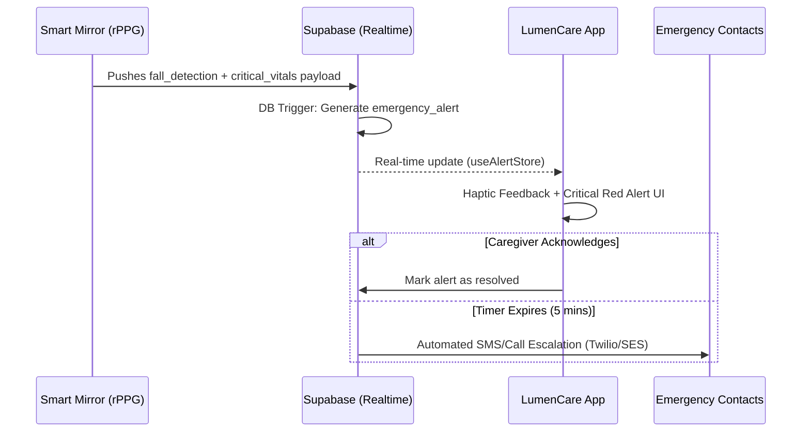

<div align="center">

```text
  _      _    _  __  __  ______  _   _   _____            _____   ______ 
 | |    | |  | ||  \/  ||  ____|| \ | | / ____|    /\    |  __ \ |  ____|
 | |    | |  | || \  / || |__   |  \| || |        /  \   | |__) || |__   
 | |    | |  | || |\/| ||  __|  | . ` || |       / /\ \  |  _  / |  __|  
 | |____| |__| || |  | || |____ | |\  || |____  / ____ \ | | \ \ | |____ 
 |______|\____/ |_|  |_||______||_| \_| \_____|/_/    \_\|_|  \_\|______|
```

## Real-Time Wellness Monitoring Mirror for the Elderly
### _"Clarity in Care"_

**A production-ready rPPG-powered Health Intelligence Ecosystem**
<br />
<sub>Built for the **National Health Hackathon 2026**</sub>

<br />


</div>

---

## 📑 Content Overview

| Section | Description |
| :--- | :--- |
| [What This System Does](#-what-this-system-does) | Core capabilities and use cases |
| [Caregiver Workflow](#-caregiver-workflow) | Visualizing the real-time alert cycle |
| [Key Features](#-key-features) | Real-time monitoring, AI summaries, and media sharing |
| [Tech Stack](#-tech-stack--core-dependencies) | Technologies and frameworks used |
| [Project Structure](#-project-structure) | Folder and file organization |
| [Database Schema](#-database-schema) | SQL structure for Vitals, Chat, and Alerts |
| [Quick Start](#-setup--installation) | Installation and setup guide |

---

## 🔍 What This System Does

| Domain | Monitoring Capability |
| :--- | :--- |
| Physiological Health | Real-time tracking of heart rate, respiration rate, and stress level indices via rPPG sensors. |
| Emotional Well-being | Behavioral analysis of patient reactions and interactions with the Smart Mirror. |
| Proactive Safety | Instant, rule-based notifications for occurrences such as fall detections or critical vital anomalies. |
| Emotional Connection | Secure media-sharing channel (Daily Drops) to push photos and messages to the patient in real-time. |

---

## 🔄 Caregiver Workflow



---

## 🚀 Key Features

| Feature | Description |
| :--- | :--- |
| Smart Sync Monitoring | Real-time **"Last Sync"** tracking with relative date-aware timestamps (e.g., "Yesterday 10:15 PM") for transparent data freshness. |
| Multi-Range Health Trends | Longitudinal analysis with three localized viewing modes: **Daily (1D)** for granular scans, **Weekly (1W)** with a 7-day range picker, and **Yearly (1Y)** for monthly averages. |
| Strict Profile Isolation | Enterprise-grade data partitioning ensuring zero "ghosting" or data leakage between multiple monitored elderly profiles. |
| Safety Alert Infrastructure | Real-time fall detection and critical vital alerts powered by Supabase triggers and native push notifications. |
| Lumen IQ (AI Chat) | A session-based, context-aware AI assistant that answers caregiver questions based on the latest patient data. |
| Mirror Interaction Loop | Two-way media sharing (Daily Drops) with real-time mirror reactions (smiles/waves) displayed in a premium conversational feed. |
| Daylight Glass Aesthetic | A premium, wellness-focused UI featuring glassmorphism, smooth depth transitions, and context-aware haptic feedback. |

---

## 🛠 Tech Stack & Core Dependencies

| Mobile Framework | React Native with Expo (v54.0.0) |
| Backend as a Service | Supabase (PostgreSQL, Realtime, Auth, Storage) |
| State Management | Zustand (Global persistence and profile orchestration) |
| Data Visualization | React Native Gifted Charts (Optimized horizontal-scrolling trends) |
| Feedback Systems | Expo Haptics & Reanimated (Native micro-interactions) |
| UI & Icons | Vanilla CSS with design tokens and Lucide/Feather icons |

---

## 📂 Project Structure

```text
LumenCare/
├── assets/                    # Optimized icons and static branding resources
├── supabase/                  # SQL migration, schema scripts, and RLS policies
│   ├── vitals_schema.sql      # Core algorithmic vitals logging
│   ├── care_chat.sql          # AI Chat session persistent infrastructure
│   └── emergency_contacts.sql # Hierarchical safety escalation database
├── src/
│   ├── components/            # Reusable Atomic UI Components
│   │   ├── AIHealthSummary.js # LLM-based wellness insights generator
│   │   ├── LumenChat.js       # Session-based AI assistant interface
│   │   └── AutonomicGauge.js  # High-fidelity HRV stress level visualization
│   ├── screens/               # Screen-level Orchestrators
│   │   ├── DashboardScreen.js # Real-time central health command board
│   │   ├── TrendsScreen.js    # Multi-dimensional historical vitals analyzer
│   │   └── SafetyScreen.js    # Emergency alert and fall detection monitor
│   ├── store/                 # Global state orchestration via Zustand
│   │   ├── useVitalsStore.js  # Real-time health data sync and buffering
│   │   ├── useProfileStore.js # Cross-patient profile orchestration
│   │   └── useSettingsStore.js# Dynamic safety and app preferences sync
│   ├── theme/                 # Global Design tokens (Colors, Spacing, Radii)
│   └── navigation/            # Native navigation stack and tab definitions
└── README.md
```

---

## 📦 Setup & Installation

**1. Clone the Repository**
```bash
git clone https://github.com/itznotpk/LumenCare-Smart_Wellness_Mirror.git
```

**2. Install Dependencies**
```bash
npm install
```

**3. Configure Environment**
Create an `.env` file in the root for Supabase credentials:
```env
EXPO_PUBLIC_SUPABASE_URL=your_project_url
EXPO_PUBLIC_SUPABASE_ANON_KEY=your_anon_key
```

**4. Run Database Migrations**
Execute these SQL scripts in your Supabase SQL Editor:
1. `supabase_vitals_schema.sql` (Vitals logging)
2. `supabase_care_chat.sql` (AI Chat infrastructure)
3. `supabase_emergency_contacts.sql` (Safety escalation)
4. `supabase_interactive_schema.sql` (Daily Drops & RLS)

---

## 🚀 Running the Application

```bash
# Start the Expo bundler
npx expo start
```
1. Download **Expo Go** on your iOS/Android device.
2. Scan the **QR Code** in your terminal.
3. The app will sync and run natively on your device.

---

## 🆕 Vision & Next Steps

*   ✅ **National Health Hackathon 2026**: Stable production release.
*   ✅ **Dynamic Viewing Modes**: 1D, 1W, and 1Y viewing with monthly averaging.
*   ✅ **Real-Time Interaction Feed**: Merged mirror reactions and daily drops.
*   ✅ **Data Privacy Walls**: Full profile isolation across all health indices.
*   ⏳ **Mirror Presence Detection**: Tracking active patient interaction time.
*   ⏳ **Pharmacy Integration**: Pharmacy-linked medicine adherence tracking.
*   ⏳ **Multi-Home Hubs**: Unified management for multiple mirror locations.

---
*LumenCare — Clarity in Care.*
